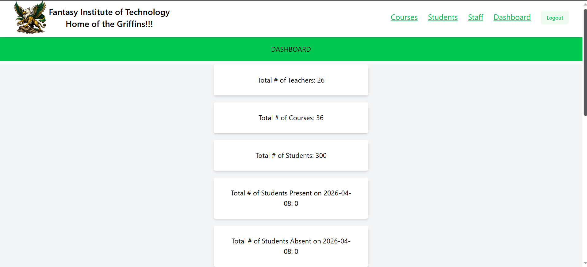
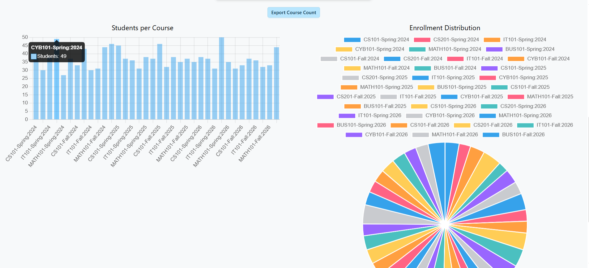
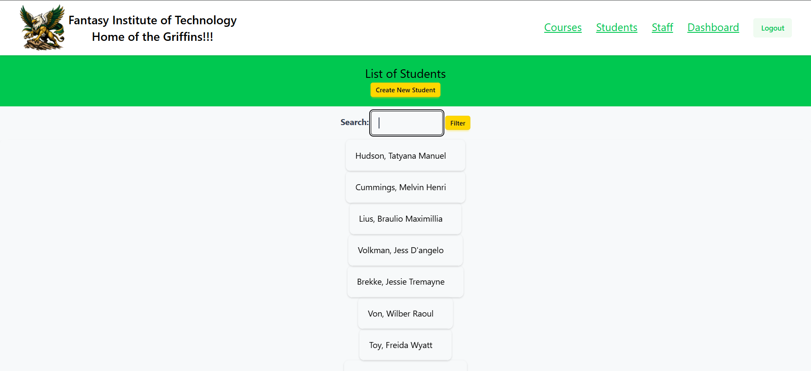
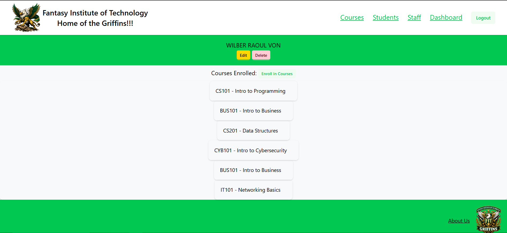
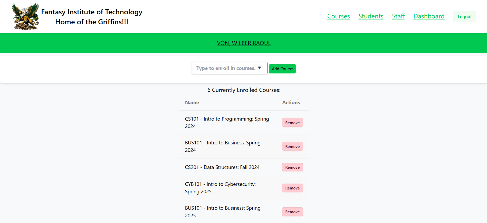
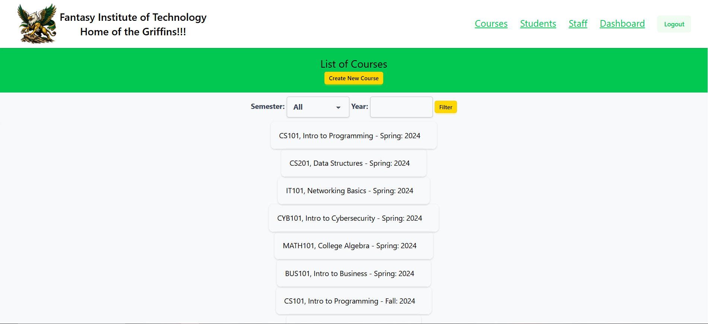
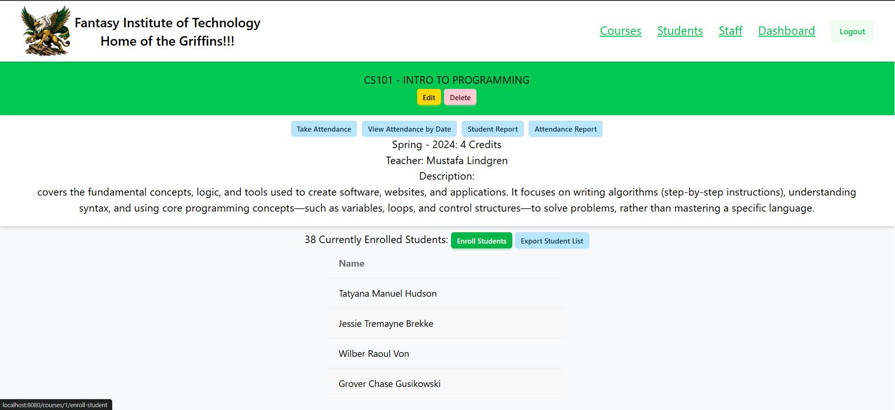
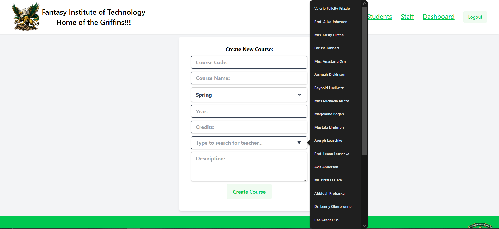
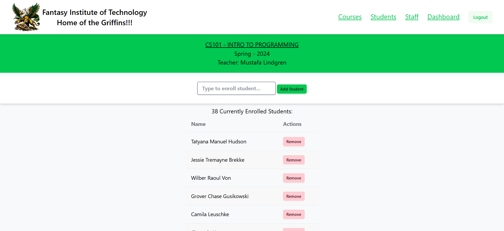

**Fantasy Institute of Technology**
Student Information System

Portfolio Project – Backend Development

A web-based Student Information System (SIS) designed for the fictional Fantasy Institute of Technology, a community college used as a development environment for practicing backend architecture, database design, and administrative tools.

This project simulates common features found in real educational management systems, including student enrollment, course management, grade tracking, and faculty administration.

## Features

Student profile management

Instructor and staff management

Course and department management

Class enrollment system

Attendance tracking

Gradebook system

Administrative dashboard

Role-based authentication (Admin / Faculty / Student)

## Roadmap

Planned features:

- [x] Student CRUD system
- [x] Instructor/Staff management
- [x] Course enrollment
- [ ] Gradebook module
- [ ] Transcript generation
- [ ] GPA calculator
- [ ] API endpoints

**Project Purpose**

This project was created as a portfolio piece to demonstrate:

Laravel application architecture

relational database design

CRUD system development

role-based authentication

administrative dashboard development

The fictional Fantasy Institute of Technology environment allows the system to simulate real-world educational administration workflows.

## Dashboard

## Student Management
Paginated List of Students with searching functionality.

View Student info including the current Courses enrolled in.

Ability to Enroll and Remove from Courses.

## Course Management
Listing of All Courses with Semester and Year filtering.

Info of the Course including list of Students enrolled.
Options to take Attendance, view all/previous Attendances, and Reports for Students and Attendance.

View the Creatation of a Course.

From Course info able to enroll or remove Students.
